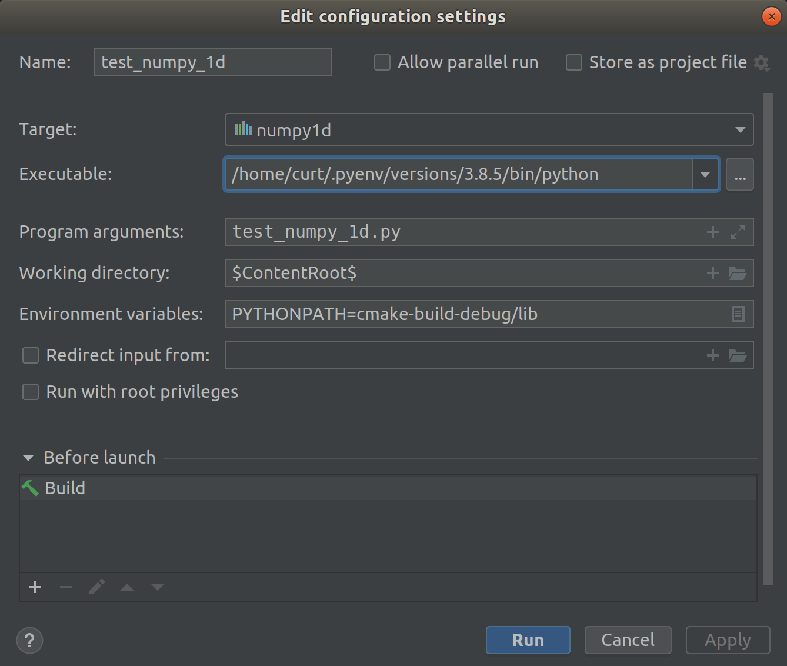

## cmake python 설정

    -DPYTHON_EXECUTABLE=/home/curt/.pyenv/versions/3.8.3/bin/python

## howto
    
    mkdir build && cd build
    conan install ..
    cmake -DPYTHON_EXECUTABLE=$(which python) ..
    make
    PYTHONPATH=lib python ../test_vector.py
    PYTHONPATH=lib python ../test_numpy_1d.py
    PYTHONPATH=lib python ../test_numpy_2d.py
    PYTHONPATH=lib python ../test_numpy_2d_eigen.py
    PYTHONPATH=lib python ../test_oop.py 
    PYTHONPATH=lib python ../test_nested.py
    PYTHONPATH=lib python ../myopencv.py

    PYTHONPATH=lib python ../scoped_enum_test.py

## reference
https://github.com/tdegeus/pybind11_examples
http://unixnme.blogspot.com/2019/11/debug-pybind11-c-extension-with-clion.html

## clion에서 debugging

